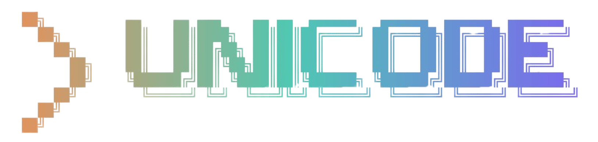

<p align="center">
  
</p>

# Unicode — AI Agent Orchestrator

Multi-agent orchestrator that coordinates **Claude Code**, **Codex CLI**, and **Qwen CLI** to collaboratively plan, implement, and review code — with persistent memory, structured project notes, and an extensible skills ecosystem.

## How it works

```
Phase 0: Clarify      — Claude asks clarifying questions (skipped in auto mode)
Phase 1: Discuss      — Claude + Codex debate the approach (N rounds per tier)
Phase 2: Plan         — Qwen synthesizes the discussion into a structured plan
Phase 3: Implement    — Claude implements the plan with full file access
Phase 4: Review       — Two-pass review loop:
                          · Codex reviews the git diff → APPROVED or CHANGES_REQUESTED
                          · Claude validates Codex's findings → CONFIRMED or APPROVED
                          · Claude (developer) fixes all confirmed issues
                          · Repeats until approved or max cycles reached
Finalization          — Commit, update context files, write to shared memory
```

**Agent roles:**
- **Claude** — discussion, implementation, secondary review, context file synthesis
- **Codex** — discussion, primary code review, minor fixes
- **Qwen** — plan synthesis, `orchestrator.md` documentation

## Prerequisites

You need these CLI tools installed and available on your PATH:

| Tool | Install |
|---|---|
| **Claude Code** | `npm install -g @anthropic-ai/claude-code` |
| **Codex CLI** | `npm install -g @openai/codex` |
| **Qwen CLI** | `npm install -g @anthropic-ai/qwen` |
| **Python** | 3.10+ |
| **Node.js** | 18+ (for `npx skills`) |

Make sure `claude`, `codex`, and `qwen` all work from your terminal before proceeding.

## Install

```bash
git clone https://github.com/Abedishere/unicode.git
cd unicode
pip install -e .
```

This gives you the `unicode` command globally.

## Usage

```bash
# Interactive — prompts for task, tier, and working directory
unicode

# Pass a task directly
unicode --task "build a REST API with Flask"

# Specify working directory and tier
unicode --task "add authentication" --working-dir ./my-project --tier standard

# Auto-approve all gates (non-interactive / CI mode)
unicode --auto

# Commit and push on completion
unicode --auto-commit --push

# Force a specific developer model
unicode --dev-model opus

# Resume a previous session
unicode --resume
```

## Task Complexity Tiers

Select at startup or via `--tier quick|standard|complex`:

| Tier | Developer Model | Review Cycles | Discussion Rounds |
|---|---|---|---|
| `quick` | claude-sonnet | 1 | 1 |
| `standard` | claude-sonnet | 2 | 2 |
| `complex` | claude-opus | 3 | 4 |

## Controls

| Key | Action |
|---|---|
| `Ctrl+C` | Cancel current agent — skip to review phase |
| `Ctrl+Z` | Cancel current agent — skip to finalization |

## Approval Gates

Before each phase you are prompted:

| Response | Action |
|---|---|
| `y` / `yes` | Proceed |
| `n` / `no` | Skip this step |
| `e` / `edit` | Pause and provide additional instructions |
| `a` / `all` | Auto-approve all remaining gates this session |

## Configuration

Edit `config.yaml` in the project root:

```yaml
discussion_rounds: 4
max_review_iterations: 3
claude_model: "opus"
codex_model: "gpt-5.3-codex"
qwen_model: "qwen3-coder"
dev_model: "sonnet"
timeout_seconds: 600
codex_timeout_seconds: 300
auto_commit: false
working_directory: "."

tiers:
  quick:
    dev_model: "sonnet"
    max_review_iterations: 1
    discussion_rounds: 1
  standard:
    dev_model: "sonnet"
    max_review_iterations: 2
    discussion_rounds: 2
  complex:
    dev_model: "opus"
    max_review_iterations: 3
    discussion_rounds: 4
```

## Skills Ecosystem

Unicode integrates with the [`npx skills`](https://github.com/vercel-labs/skills) ecosystem. Two skills are bundled and available to all agents:

### find-skills
Lets agents search for and install new skills from the registry when they need specialized knowledge.

```bash
# Install (already included, but to update)
npx skills add https://github.com/vercel-labs/skills --skill find-skills -g
```

Agents can run `npx skills find [query]` to discover skills on demand.

### project-memory
Defines a structured format for persistent project notes in `.orchestrator/`. The orchestrator writes to these files automatically at the end of every task.

```bash
# Install (already included, but to update)
npx skills add https://github.com/spillwavesolutions/project-memory --skill project-memory -g
```

Skills are installed to `.agents/skills/` (universal) and symlinked into `.claude/skills/`, `.qwen/skills/`, and `~/.codex/skills/` so every agent picks them up natively.

## Persistent Memory

After each run, unicode maintains two parallel memory stores in your working directory:

**YAML index** (`.orchestrator/memory.yaml`) — machine-queryable, auto-injected into every agent prompt:
- Architecture decisions, codebase conventions, past mistakes, task history

**Markdown notes** (`.orchestrator/`) — human-readable, follows `project-memory` skill format:

| File | Contents |
|---|---|
| `bugs.md` | Bug log with root causes, solutions, and prevention notes |
| `decisions.md` | Architectural Decision Records (ADRs) — numbered, dated |
| `key_facts.md` | Project config, ports, credentials, important URLs |
| `issues.md` | Work log — completed tasks with outcomes |

Relevant entries from both stores are automatically surfaced in agent prompts for future tasks, giving agents institutional knowledge without manual intervention.

## Files Generated in Your Working Directory

| File | Written by | Purpose |
|---|---|---|
| `CLAUDE.md` | Codex (synthesized) | Project context for Claude Code CLI |
| `AGENTS.md` | Codex (synthesized) | Project context for Codex CLI |
| `orchestrator.md` | Qwen | Full project summary, architecture, folder structure |
| `.orchestrator/bugs.md` | Orchestrator | Structured bug log |
| `.orchestrator/decisions.md` | Orchestrator | Architectural Decision Records |
| `.orchestrator/key_facts.md` | Orchestrator | Project config and key facts |
| `.orchestrator/issues.md` | Orchestrator | Work log |
| `.orchestrator/history.md` | Orchestrator | Run history |
| `.orchestrator/plan.md` | Orchestrator | Latest implementation plan |
| `.orchestrator/memory.yaml` | Orchestrator | Machine-queryable memory index |
